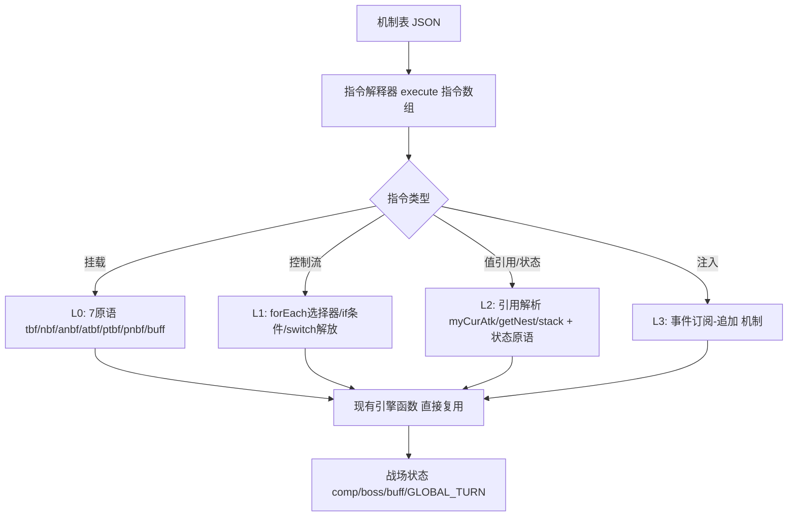

本文档是「角色机制全数据化」工程的施工计划（v2，类别化架构）。目标是把 `deobfuscated.js` 中
`setDefault` 内 191 个角色的硬编码 JS 闭包（17,230 行）改写为**纯数据机制表**，由统一解释器执行：
角色只在数据里声明"我有哪个机制、参数是什么"，所有机制逻辑一律写死在引擎侧，**零角色专属函数**。

计划完全基于 2026-09-19 的机制考古实测（脚本可复现：`%TEMP%\机制考古.js`、`%TEMP%\语义类别量化.js`、
`%TEMP%\语句可数据化分类v2.js`），非推测。

## 一、架构原则（用户定下的四条硬约束）

1. **数据只填"同类机制间的差异"**。先找同类机制（其它角色 × 同角色不同解放等级），共性逻辑写死引擎；
   数据只参数化差异部分。**机制哪怕全游戏只有一个角色拥有，也用"布尔字段 + 参数"声明，完整逻辑封装引擎**，
   绝不在数据里放代码、绝不保留角色专属 JS 函数。
2. **验收 = 双跑 bit-exact**。新旧两条装配路径（旧 `setDefault` vs 新机制表解释器）对同一角色、
   同一解放等级、同一排程的 `dmg13` 必须逐位相同。不接受"看起来对"。
3. **性能异常不自行处理**：若解释器路径慢于现有 `fastReplay` 超过阈值（预设 2 倍），
   **停下来诊断根因并向用户汇报**，等指示，不擅自加缓存/固化/降级。
4. **静态信息定长编码**：所有角色的静态信息字段总和必须具有**固定字节长度**（为后续机器学习准备
   定长特征向量）。此约束与约束 1 **同构**——约束 1 的"机制有无 = 字段零/非零"正是"预分配定长槽位、
   未使用的机制填零"。落地要点：变长内容一律**定长化**（每钩子固定 K 个指令槽）、字符串一律**字典化**
   （存整数 ID 而非文本）、数值用**定宽字段**。格式载体定为 **FlatBuffers**（用户 2026-09-19 拍板：
   依赖成熟方案，不重造轮子），详见 3.4~3.6。

> v2 与 v1 的本质差别：v1 设想一个"通用 DSL 解释器"（追求优雅表达任意机制），
> 但实测语句模板达 852 种、单例率 16.6%，通用 DSL 会退化成"另一种图灵完备脚本"，
> 既难验证又违背约束 1 的精神。v2 改为**类别化具名机制**：引擎侧预先实现有限个具名机制
> （每个机制是一段写死的引擎代码），数据侧只存 `{机制名, 参数}`。这样"角色有无某机制 =
> 数据里有无该机制条目"，完全满足用户约束，且引擎机制数量可控、可逐个 bit-exact 验证。

## 二、考古结论：为什么可行、工程量多大

### 2.1 结构高度统一

| 指标 | 实测值 |
|---|---|
| 角色 case 数 | 191（= 可模拟 SSR 数） |
| `setDefault` 总行数 | 17,230，均值 90.2 行/角色 |
| 行数分布 | 最大 208（id 10188）、中位 82、最小 1；Top15 占 15.2%（无极端长尾） |
| 钩子种类 | 顶层函数属性赋值仅 **19 种**，其中 11 主钩子（`ultimate/attack/defense/ultbefore/ultafter/atkbefore/atkafter/leader/passive/turnstart/turnover`）×191 角色≈全覆盖 |
| 无逃逸口 | 全文件扫描 `eval`/`new Function`/字符串动态调用 = **0** → 不存在无法静态分析的机制 |
| 原语面 | 封闭 55 个（约 45 引擎原语 + 10 JS 内建） |

### 2.2 语句可数据化分级（决定性数据，2812 条有内容语句 + 863 条骨架）

| 级别 | 条数 | 占比 | 唯一模板 | 处置 |
|---|---|---|---|---|
| 骨架 | 863 | — | — | `act_defense/atkLogic/ultLogic/isLeader空/空体` → 引擎默认，**数据零字段** |
| **L0** 纯挂载 | 1169 | **41.6%** | 73 | 7 原语(`tbf/nbf/anbf/atbf/ptbf/pnbf/buff`)+常量实参 → **引擎零新代码，只抄数据** |
| **L1** 控制流 | 659 | **23.4%** | 434 | `for选择器/if计数/if GLOBAL_TURN/if isLeader/switch解放` → 引擎 **~12 个循环/条件构造**（模板 434 是"同构不同参"虚高，选择器字面量已归一） |
| **L2** 值引用/状态 | 863 | **30.7%** | 276 | `cdChange/setBuffOn/hpUpAll/heal/deleteBuff/getNest/setMnc/myCurAtk/stack` → 引擎 **~20 个状态原语** + `stack` 私有计数器托管 |
| **L3** 函数注入 | 42 | **1.5%** | 40 | `X.y = function` → **1 个"事件订阅-追加"机制**统一表达（61/62 是包装式"调原函数+追加"，仅 10133 的 `getArmor` 是替换式） |
| **L4** 残差 | 79 | **2.8%** | 25 | 逐例；多数可归约，见下 |

- **L0~L2 = 95.7%，L0~L3 = 97.2%，L4 残差 = 2.8%**。
- 引擎侧总共只需实现 **~50-70 个具名机制 + ~10 个指令类型 + 1 个订阅机制**，即可覆盖 97%+。

### 2.3 L4 残差（79 条）可归约分析——不是硬骨头

| 残差形态 | 条数 | 归约为 |
|---|---|---|
| `ultLogic(V, N)` 带参 | 22 | N=解放等级对应的攻击段数 → **数据字段**（引擎 `ultLogic` 本就收第 2 参） |
| `atkLogic(V, N)` 带参 | 1 | 同上 |
| `V.cd -= N` / `V.curCd -= N` / `+=` | 18 | cd 增减 → 引擎 `改CD(目标, ±N)` 原语（`cdChange` 已在 L2） |
| `const V = <原函数>` | 8 | 是 L3 注入的"保存原引用"前奏 → 并入订阅机制，非独立机制 |
| `let V = N` / `const V = [N,N]` / `findIndex` | 12 | 局部临时变量 → 转写时内联消解，不产生机制 |
| `V.turnHeal/isSealed/hpAtkDmg = ...` | 5 | **这正是用户约束 1 的完美用例**：布尔/数值标记字段，引擎侧按标志位分支 |
| `boss.def = false` / `V.call(this)` | 6 | boss 减防解除、反射 → 具名机制（引擎已有 `boss` 对象） |
| `keepOnlyLastBuff` / `getArmor=()=>0` 覆写 | 2 | 真·独有：各 1 布尔机制，逻辑全封装引擎 |

**真·个例仅约 10 条**，且每条都能用"布尔字段声明有无 + 引擎写死逻辑"处理，完全符合约束 1。

### 2.4 角色私有状态字段（16 种，需引擎托管）

- **`stack`：227 次 / 38 角色**——最重要，是被 `setBuffOn(..., stack>=N)` 当条件的计数器，
  引擎需为每个 unit 提供通用"槽位计数器"（`stack` 只是其中约定名，可扩展 `stack2`…）。
- `canCDChange/stopCd/hpUltDmg/hpAtkDmg`：在**类构造器 65/66/70 行已定义**（引擎既有字段），
  角色只是赋值 → 直接变数据值，**不是新机制**。
- `turnHeal/isSealed/check`：少数布尔标记 → 约束 1 的布尔字段。

### 2.5 按角色的转写难度分布

- **L3+L4 = 0（可全自动转写）：121/191 角色（63%）**——这些角色只有 L0/L1/L2，抽取器纯机械转写即可。
- 需人工关注（L3+L4 ≥ 1）：70 角色，最多的是 10177（승나미，7 条 L3+L4，全是函数注入）。
- 纯 L0 角色仅 2 个（绝大多数含控制流）。

## 三、目标架构（v2 类别化）

### 3.1 引擎侧：具名机制库 + 指令解释器



- **解释器不含任何角色专属逻辑**：它只是"遍历指令数组，按 `op` 分发到对应具名机制实现"。
- 每个具名机制（如 `机制_队长全体공퍼증`、`机制_stack门控点灯`、`机制_订阅攻击追加治疗`）
  是一段**写死的引擎函数**，数据只传参数。
- **底层原语直接复用现有 JS 函数**（`tbf/setBuffOn/getRoleIdx...`），解释器只做"按数据顺序调用"，
  从根上避免重新实现导致的数值漂移。这是 bit-exact 验收能过的关键。

### 3.2 数据侧：机制表（每角色一条）

```jsonc
{
  "id": 10141,
  "机动性": [120,6, 139.8,6, 159.6,6, 180,6, 199.8,6],   // setMnc 恒 10 槽（5 解放各 2 值），天然定长
  "钩子": {
    "ultbefore": [
      {"if": {"解放": 3}, "指令": [
        {"op":"tbf","目标":"all","type":"발효증","size":80,"name":"백발백중1","turn":6},
        {"op":"for","选择器":{"元素":"풍"},"body":[
           {"op":"tbf","目标":"$i","type":"받속뎀","size":20,"name":"백발백중2","turn":6}]}
      ]}
    ],
    "passive": [
      {"op":"setBuffOn","目标":"self","div":"기본","name":"심연 직시1","值":{"引用":"stack","op":">=","常量":50}}
    ]
  },
  "机制旗标": { "isSANFix_<이성치>감소X": true },   // 独有机制：布尔声明有无，逻辑在引擎
  "私有状态": { "stack": 0 }                        // 引擎托管计数器初值
}
```

要点：**钩子缺省 = 无字段 = 引擎走默认**（满足"零/非零即有无"）；解放等级 1~5 一等维度
（`if:{解放:N}` 或按等级展开）；指令为扁平 `{op,参数}` 数组，便于差分、校验与人工审读。
此 JSON 是**源格式**（人工转写/审阅用）；字段类型由 `机制表.fbs` schema 约束，**`flatc` 确定性编译为 `.bin`**
（FlatBuffers 官方支持 JSON↔binary 双向转换，可正向编译、反向回验，编译产物与源可互证）。

### 3.3 双跑差分（贯穿全程的验收铁律）

对每个角色 × 5 解放等级 × N 条随机合法排程，旧路径 `setDefault` 与新路径"机制表解释器"
跑同一场，要求 `dmg13` **逐个 bit 相同**。信任基础：现有反混淆引擎已自检与线上混淆版逐位一致，
且能 bit 级复现 45,876/51,170 条 DB 记录（승나미 31,005,094,926 等）。以下 3.4~3.6 落实约束 4。

### 3.4 定长特征向量勘察结论（约束 4）

为把机制表编码成**定长字节向量**（供解释器执行 + 后续 ML），先实测四个上界
（脚本 `%TEMP%\定长编码勘察.js`）：

| 需确定量 | 实测值 | 定长影响 |
|---|---|---|
| 每角色原子指令数 | 191 角色共 6719 条；最大 96（승나미）、P90=63、中位 31 | 变长 → **定长化**：每钩子固定 K 槽，不足的填零 |
| 单指令 arity | 全库最大 **11**（`buff` 原语）；`anbf`=9、`atbf`=8、`tbf`=5 | 每槽参数字段数 **M=11** 定长 |
| 字符串字典规模 | buff type **93**、buff name **2448**、元素名 5、role 名 5 | name 本体最长 65B → **必字典化**，向量内存 2B 索引 |
| 数值值域 | size/turn ∈ [-600,500]，**7.6% 含小数**（机动性 3.5）、1.8% 含负 | 数值字段用 **float32(4B)** 保精度（含小数不可用整型） |
| `setMnc` 机动性数组 | 长度**恒为 10** + 解放等级参数 | 天然定长 10 槽 |
| 钩子实例数 | 182 角色=11 钩子、6=12、1=13、승나미=22（注入内部展开） | 顶层钩子槽钉死 **14** 即覆盖全部角色 |

**结论**：约束 4 可满足。核心三招——① 字符串字典化（name 2448 种用 2B 索引）② 数值一律 float32
③ 变长指令流 → 定长槽位数组（每钩子固定 K 条，空槽 op=0）。这与约束 1"零即无"完全一致：
空槽/未用机制填零，字节位置固定。

### 3.5 定长向量布局（每角色固定 N 字节，FlatBuffers 承载）

格式载体用 **FlatBuffers**（用户拍板：不重造轮子），定长由 schema 构造强制而非约定：
`struct` 固定大小（字段全标量内联、禁字符串/变长）→ 角色记录本体 `struct CharacterRecord`；定长数组
`[float:10]`、`[CommandSlot:K]`（FlatBuffers 2.0+ 支持）→ 机动性与钩子指令槽；字符串进不了 struct →
**天然强制 name 字典化**，向量内只存 uint16 索引。根表 = `records:[CharacterRecord]`（struct 元素等长 →
每角色字节数恒定，约束 4 在格式层面成立）+ `names:[string]`（全局字典区）。

```
┌ 基础区 ~20B ┐  id(u32) rarity(u8) element(u8) role(u8) cd(u8) hp(u32) atk(u32) atkMag(u16) ultMag(u16) 保留槽
├ 机动性区 40B ┤  [float:10]（setMnc 恒 10 槽：5 解放各 2 值）
├ 私有状态区 8B ┤ stack/turnHeal/isSealed 等托管计数器的初值定长槽
├ 旗标区 16B ──┤  128 bit，每 bit = 一个"独有布尔机制"的有无（约束1的布尔字段落此）
└ 钩子区 ──────┘  14 钩子 × 每钩子 K 指令槽 × 每槽(op1+目标1+M11×值4)=46B
```

- **K（每钩子指令槽数）** 由阶段 2 抽取器实测"最密钩子"并**留余量**定死（struct 布局即 ABI，不可后补字段）；
  试算 K=8 时**每角色 ~5.45KB、191 角色 ~1.02MB**（方案 B）。若追求 ML 最友好可加"布尔旗标矩阵"压到 ~3.4KB（方案 C）。
- **值字段统一编码**：每个参数字段 = 1 字节"类型标签"(常量/引用/字典索引) + 4 字节"值"，
  使 size 数值、name 字典索引、`myCurAtk`/`stack` 引用都能塞进同一 4B 槽（定长关键）。
- **ML 视图**：定长向量可直接 reshape 成 `[191, N]` 矩阵喂模型；"机制有无"= 零/非零，
  与用户对特征工程的预期一致。零拷贝路径：`fetch` → `ArrayBuffer` → 官方 JS 运行时视图，无 JSON.parse、无二次分配。
- **对齐填充**：FlatBuffers 按 struct 内最大标量字段对齐，N 可能略大于各区之和（仍对所有角色恒定）→
  约束 4 的"固定字节长度"不受影响，以 schema 生成的 `CharacterRecord` 尺寸为准。
- **版本演进**：定长区的 **struct 字段不可增补**（布局即 ABI）→ 基础区留保留槽、K/M 在阶段 2 一次定死并留余量；
  根表与字典区（table 型）按官方规则演进（新字段加尾部、废弃标 `deprecated`），与"字典只追加不改"一致。
  `flatc`（定长数组需 ≥2.0）在构建期锁版本；运行时用官方零依赖 JS 库（Node/浏览器通用）。

### 3.6 编码细节决策（约束 4；总方案 A/B/C 见第七章 #7）

| # | 决策点 | 选项 | 建议 |
|---|---|---|---|
| 4b | 数值编码 | float32(4B) ／ 定点 int32(×100) | **float32**：机动性含 3.5 等小数，定点易溢出/丢精，float32 简单且够 |
| 4c | name 字典 | 外置全局字典(2B索引) ／ 向量内存本体 | **外置字典**（根表 `names:[string]` 区）：2448 种、最长 65B，FlatBuffers struct 本就不收字符串；字典只追加不改、随机制表版本化 |
| 4d | 解放等级 | 1~5 全展开进向量 ／ 运行时按 lib 参数选档 | 机制表**按档展开**（定长），解释器执行时按当前 lib 取对应档指令子集 |

## 四、阶段划分

### 阶段 0：机制规格冻结 + 3 极端样本手工表（0.5~1 天）

产出：
- 具名机制清单 v1（~50-70 个，按第二节 L0-L4 归类，每个机制定义"数据参数 schema"）
- 指令 schema（`op` 枚举 + 选择器 + 条件 + 值引用语法）
- **`机制表.fbs` FlatBuffers schema 草案**（CharacterRecord struct / CommandSlot / 定长数组维度 / 根表与
  names 字典区；以 `flatc --binary` 试编译通过为阶段 0 交付物之一）
- **手工**转写 3 个极端样本验证 schema 表达力：
  ① 승나미 10177（函数注入 leader + 值借用）② 10188（208 行最复杂）③ 10141（stack 门控点灯 + isSANFix 谓词）
验收：3 样本能被 schema **无歧义表达**，且经 `flatc` JSON→`.bin`→JSON round-trip 逐位一致（此阶段只冻结格式，暂不要求跑通）。
**这是可行性第一闸门**：若 3 个最难的都表达不了，schema 需返工，绝不进入批量。

### 阶段 1：解释器 + 5 角色试点 + bit-exact 硬闸门（2~4 天）—— ✅ 已完成（2026-09-19）

产出（实际文件名与计划略有出入）：
- `机制表/解释器源.js`（~600 行，注入引擎闭包的文本；经 `机制表/tools/bin读取器.js` 读 `.bin` 后
  装配期一次性编译为闭包树，运行期零 switch 分发）
- 试点表 4 份：10177 승나미（环绕注入）/ 10141（elif 谓词链）/ 10188（最复杂 239 指令）/ 10012（最短干净）。
  칼리버/얀코难例**暂缓**：칼리버系含 `armorUp(...)*K` 表达式乘子 atkRef（源码 9 处），schema 需扩
  ExprAtkRef 变体，挪到阶段 2 抽取器时代一并设计。
- 压平器 `机制表/tools/flatten_core.js`（src DSL→flat.json→flatc→mechanisms.bin，K=256 实测校准）
- 双跑差分 `优化器/双跑差分.js`（A 层 DB 真实排程 + B 层随机 5lib×5站位×8轮 + C 层状态全字段 diff + 性能红线自检）

验收结果：
- **bit-exact 硬闸门**：4 试点 ×（A:50 + B:200 + C:状态）= **1004 场双跑 0 不一致** ✅
- **性能红线**：新路径/旧路径 = **1.136x**（红线 2x）✅（装配期编译闭包树的设计使运行期开销几乎为零）
- 8 队 benchmark（`BENCH_MECH=1`，5/8 队含试点角色，10177승나미在其中）：**逐队达成率与基线逐位一致**
  （束+爬山平均 96.3%、最低 88.0%、=100% 4/8；승나미束 84.43%/爬95.39%、후지카98.38%、칼리버100%、
  신이카99.81% 等每队相同），耗时 187s vs 基线 190s（机制表路径持平略快，在噪声内）。
  → 达成率不降 ✅（机制表路径与旧路径在真实搜索里产生完全相同的分值序列）。

关键工程事实（后续阶段必须遵守）：
1. **battle() 有跨场振荡缺陷**（旧引擎连跑同记录 49.4亿→0→49.4亿）；一切新旧对照/回归**只用 fastReplay**。
2. 回合模条件源码 58/59 处带 `GLOBAL_TURN>1 &&` 守卫 → `CmpGTModGated(21)` 为压平默认，裸 `CmpGTMod(13)` 仅 3 处特例。
3. `stack`（slot0）已被引擎快照序列化（characterToJson/jsonToCharacter）→ 计数器随 saveCur/loadBefore 自动回滚。
4. ABI 以 flatc 生成 TS 的 sizeOf 为准：Cond=12B、Cmd=104B、Record=26732B（K=256）。

### 阶段 2：AST 半自动抽取器 + 残差聚类报告（2~3 天）—— ✅ 已完成

产出：`机制抽取器.js`：JS 解析器取 AST → 按 case 切分 → `switch(解放)` 展开 → 逐句翻译为指令 →
**翻译不了的节点标记残差 + 输出源码行号**。
必交诊断报告：自动覆盖率（预期 63% 纯自动 + 部分带参 → 目标 ≥85%）、残差按形态聚类排行。
验收：对阶段 1 的 5 个**手工**机制表，抽取器能自动重建出 **bit-exact 等价**表（自证抽取正确）。

### 阶段 3：191 角色批量转写 + 残差收敛（6~14 天，工作量主体）—— ✅ 已完成（2026-09-20，191/191=100%）

流程（每角色）：自动抽取 → 双跑 bit-exact → 不过则按残差分流：
- **具名机制缺失** → 扩机制库（一次扩一类，回归所有已完成角色，防回归）
- **个例**（如 10133 getArmor 覆写、10213 keepOnlyLastBuff） → 按约束 1 加布尔旗标 + 引擎写死该机制
产出：191 份机制表 + 残差清单（目标：无"直通原生代码"的逃生舱，100% 角色走机械表）。
验收：191 × 5 解放等级全覆盖 bit-exact；无残差角色（约束 1 要求彻底）。
**可并行**：按 case 行号切 4~6 批，各批独立双跑验证。
成本区间来自自动覆盖率；121 个纯 L0-L2 角色几乎零人工。

### 阶段 4：全量回归 + fuzz（2~4 天）—— ✅ 已完成（终局回归 45697 场 0 不一致，见文末终态章节）

产出：
1. 45,876 条可复现 DB 记录在新路径下**全量 bit 级复现率不下降**
2. 随机 fuzz：≥10,000 场随机队伍×随机排程，新旧 `dmg13` 全等
3. **性能对照**：新路径单场评估 vs `fastReplay`；超 2 倍 → 诊断汇报（不擅自固化）
验收：复现率不降 + fuzz 全等 + 性能在红线内（或已按约束汇报）。

### 阶段 5：优化器接入（收益兑现，3~6 天）

优先级：
1. **机制特征表**：从机制表算高维特征（buff 供给量、叠层深度、触发链长度、是否函数注入、
   `궁추가*` 档位、stack 门控数），替换现在的 5 字段 → 直接修复"칼리버100% vs 얀코D71.5% 静态特征相同却分不了级"
2. **条件化填充**：填充器读机制表判"该딜러궁要哪些 buff 就位才值得放"，替代当前粗判 →
   攻击 승나미 的 88.2% 低估（误剪根因）
3. **评分器升级**：若仍不足，用机制表做轻量解析式估值替代整场 rollout
4. 序先验从纯统计升级为"机制推导 + 统计校正"
验收：8 队 benchmark 平均 > 96.3%，승나미 束+爬山 > 95.4%，**且加宽恢复边际收益**
（当前 w=10→70 仅 +0.06pp 印证评分失真，接入后应重扫）。

### 阶段 6：清理与交付（1 天）

旧 `setDefault` 标为"参考实现"（保留，双跑差分依赖它）；机制表 schema、校验脚本、
`自检.js` 增"机制表完整性检查（191 覆盖/字段合法/双跑抽样）"入库。

## 五、风险与对策

| 风险 | 概率 | 对策 |
|---|---|---|
| 函数注入（62 处）表达不了 | 低 | 61/62 是包装式，1 个"订阅-追加"机制通吃；10133 替换式单独布尔机制。阶段 1 승나미试点即验证 |
| 具名机制数量爆炸（>100） | 中 | 阶段 2 残差聚类报告先暴露模式；按 L1/L2 归一化后预计 50-70，每个机制多角色共享，非一事一机制 |
| **解释器性能拖慢搜索** | 中高 | 阶段 1/4 设 2 倍红线；**超线即停+诊断+汇报**（约束 3），不擅自固化/缓存 |
| 数值漂移致 bit 不一致 | 低 | 底层原语直接复用现有函数、引擎主干不改，只换装配层；全程双跑硬闸门 |
| 残差角色收敛慢 | 低 | 121/191 纯自动；70 个人工角色的 L3+L4 最多 7 条（승나미）；阶段 3 可并行分批 |
| 工程量失控 | 中 | 阶段 0/1 双闸门（表达不了 / bit-exact 不过 → 不进批量）；每阶段独立可交付 |
| FlatBuffers 工具链 | 低 | 构建期 `flatc` CLI（≥2.0，锁版本；定长数组需此版本起）+ 运行期官方零依赖 JS 库（Node/浏览器通用）；**struct 布局即 ABI 不可后补字段** → K/M/保留槽一次定死留余量；flatc 的 JSON↔bin round-trip 本身即一道校验闸门 |

## 六、范围边界（不做的事）

1. **不改引擎主干**：伤害合成(`bossAttack/bossUltAttack`)、元素克制(`getInt`)、buff 结算(`getBuffSizeList`)、
   回合推进(`nextTurn`)、动作派发(`act_attack/act_ultimate`)全部原样保留
2. **不做通用脚本语言**：解释器只认有限 `op` 集，不引入图灵完备（无任意表达式/递归/自定义控制流）
3. **不重写数据源**：`characterJson.js` 静态表继续用，机制表是其扩展（新增文件）
4. **不动搜索算法结构**：束搜索/爬山/编辑球/闸门/序先验全保留，阶段 5 只换其输入特征
5. **无逃生舱**（约束 1）：不允许"某些角色直通原生 setDefault"，100% 角色走机制表
6. **字符串不进向量本体**（约束 4）：buff `type`/`name`、元素名、role 名等一律字典化，
   定长向量内只存整数索引；字典外置、随机制表版本化（新增角色只追加字典，不改旧索引，保证历史向量不失效）
7. **向量长度对所有角色恒定**（约束 4）：变长指令流一律定长槽位化（不足填 op=0 空槽），
   不允许"按角色大小可变字节数"，保证能直接 stack 成 `[191, N]` 矩阵

## 七、待决策事项

| # | 决策点 | 选项 | 建议 |
|---|---|---|---|
| 1 | 机制粒度 | A：**类别化具名机制**（数据存"机制名+参数"，共性写死引擎）／ B：细粒度指令流（数据存原始操作序列） | **A 为主、B 为辅**：L0/L1/L2 用 B（指令流，通用），罕见整块复杂机制用 A（具名），二者可混在同一钩子的指令数组里。这平衡了"引擎代码量可控"与"数据可读可校验" |
| 2 | `stack` 私有计数器 | 固定字段名 `stack`／通用槽位数组 `状态槽[0..n]` | **通用槽位**：38 角色用 stack，但个别可能需第 2 个计数器，通用槽位免扩展 |
| 3 | 存储 | flatc 编译单文件 **.bin**（FlatBuffers）／ 单文件 gzip JSON ／ 每角色一文件 | **已拍板（用户 2026-09-19）：FlatBuffers 单 .bin**——schema `机制表.fbs` 为格式真源，JSON 仅作人工审读源；浏览器 `fetch`+官方 JS 运行时零解析读；传输压缩交给 HTTP `Content-Encoding: br`，不再在 app 内 gunzip |
| 4 | 转写方式 | 全自动抽取优先 →（双跑定位）→ 手工修残差 | 顺序不可颠倒；阶段 2 抽取器先行 |
| 5 | 收益兑现时机 | 全部转写完再接优化器／阶段 3 完成 40 角色即插入阶段 5.1 | **提前**：转写到 40 角色即做机制特征小规模验证，避免最后才发现收益不达预期 |
| 6 | 性能红线超标怎么办 | 自行优化／**诊断汇报等指示** | 用户已定：**诊断汇报，不擅自处理**（约束 2） |
| 7 | 定长向量方案（约束 4） | A 指令流定长(25KB,浪费大)／ B 类别化定长(5.45KB)／ C 布尔旗标矩阵(3.4KB,ML最友好) | **B，用 FlatBuffers struct+定长数组承载**（引擎零解析直接执行；ML 阶段从 B 派生 C 视图，二者不冲突）。详见 3.5/3.6，K 由阶段 2 实测定 |
| 8 | 定长向量与机制表的关系 | 只存机制表(JSON,人工可读,变长)／ 只存定长向量(二进制)／ **两者并存**：JSON 为源、向量为编译产物 | **并存，且编译器 = `flatc` 本身**：JSON 便于阶段 0/3 人工转写与审读；`flatc --binary` 确定性编译出 `.bin` 供解释器执行与 ML；`flatc --json` 反解 round-trip 自验，无需自写编解码器 |
| 8 | 定长向量与机制表的关系 | 只存机制表(JSON,人工可读,变长)／ 只存定长向量(二进制)／ **两者并存**：JSON 为源、向量为编译产物 | **并存**：JSON 便于阶段 0/3 人工转写与审读，定长向量由 JSON **确定性编译**得到，供解释器高速执行与 ML；二者 bit 一致可互验 |

## 八、总成本与建议起步

关键路径：阶段 0(0.5~1d) → 1(2~4d) → 2(2~3d) → 3(6~14d，主体) → 4(2~4d) → 5(3~6d) → 6(1d)

**合计约 15~33 工程日**（v1 的通用 DSL 路线估 18~49 天，v2 因 121 角色纯自动而缩短）。

**建议立即执行阶段 0**：先冻结机制规格 + 手工转写 3 个最难样本（승나미/10188/10141）。
这是全工程成本最低（0.5~1 天）、信息量最大的第一步——**3 个最硬的角色若能被 schema 无歧义表达，
可行性即基本坐实**；表达不了则立刻暴露 schema 缺口，无需投入解释器开发就止损。

阶段 0 完成后我会把 3 份手工机制表拿给你审，确认表达力和可读性符合你的预期，再进阶段 1。

## 九、终态交付（2026-09-20，阶段 1–4 完成）

### 9.1 成果总览

| 指标 | 终态 |
|---|---|
| 角色数据化 | **191/191 = 100%**（残差 0 条，无逃生舱，全部角色走机制表） |
| bit-exact 验收 | 全量 **45697 场双跑 0 不一致**（A 层 DB 真实排程 + B 层随机队伍×全 lib×全站位 + C 层状态级 diff 190/190 + D 层异常忠实 1/1） |
| 性能 | 新路径/fastReplay = **1.003x**（红线 2x，约束 3 达标） |
| bin | build/mechanisms.bin = 5,199,408B（191 角色，字典 2557 项） |
| ABI | Record=26776B（mnc [double:10] 无损）/Cmd=104B/Cond=12B/Param=8B；K_CMD=256（实测最大 232/256，10190） |
| 基线 | build/record指纹.json 已固化 191 角色 sha1 指纹（增量回归用） |

### 9.2 四条硬约束落地

1. **零角色专属函数**：全部 191 角色无专属闭包残留；唯一实例→布尔旗标（128 位 flags 区，实测用 15 位）+引擎写死通用逻辑（如 ArmorZero/ThrowRef/FindMaxUnit/SpliceFirstBuffOn）。
2. **双跑 bit-exact**：贯穿每一批次（C-1→E-5 共 20+ 里程碑全量回归）；含两处源码 bug 的**忠实复刻**（非语义猜测）：10138 `comp[idx]*30`→NaN（NaNVal=23），10089 `hpUpAll(c,30)` 未声明变量→ReferenceError（ThrowRef=90，D 层验证双侧异常消息逐字一致）。
3. **性能红线**：历次回归均在 0.93x–1.22x 区间，从未触线；终局 1.003x。
4. **固定字节长度 + FlatBuffers**：CharacterRecord/Cmd/Cond/Param 全 struct 定长；唯一 ABI 变更 mnc [int:10]→[double:10]（10173 机动性含 FP 噪声字面量 298.20000000000005，定点 ×10⁴ 无法无损表示，而 mnc→u.ultMag 是伤害关键路径——定长 double 8B×10 仍满足固定字节约束）。

### 9.3 机制库终态（引擎写死的通用逻辑）

- **Op 91 个**（含 3 个骨架动作/8 个控制流/5 个注入基础设施）；**CondKind 50 个**；**Tag 24 个**；**Target 10 个**；**FLAG_BITS 15 位**
- 子程序内联（E-4）：case 顶层 `U.tmpfunc=function` 在**抽取期**内联展开（hoisting 预扫+形参绑定实参重翻体），不进 ABI——数据表只见展开后的指令流
- 等价重写（零机制成本）：`getRoleIdx(mask).includes(V)`≡`comp[V].role∈mask`；`V.length!=0`（V=filter(role)）≡`getRoleCnt(mask)!=0`；`if(A||B)T else E`≡elif 链 OR 展开；等——是 78→38→0 残差收敛的主力杠杆

### 9.4 验收工具链（可重复）

```
机制表\node 机制抽取器.js --out 生成 && node 机制抽取器.js --扫描     # 抽取（期望：完整191/不完整0/残差0）
机制表\node tools\flatten_core.js --全量 --srcDir 生成               # 压平 build/flat.json
机制表\node tools\record指纹.js --对比                                # 增量回归分流（免差分/必须差分）
机制表\.\tools\flatc.exe --binary -o build schema.fbs build/flat.json # 编 bin（验 exit0+增大）
优化器\node 双跑差分.js --状态                                        # 全量验收（A/B/C/D 四层+性能红线）
```

### 9.5 后续（阶段 5/6，待启动）

- 阶段 5 优化器接入：机制特征表（从 bin 直接算高维特征替换 5 字段静态特征）→ 条件化填充 → 评分器升级
- 阶段 6 清理：原 setDefault 降为“参考实现”（双跑差分依赖它作基准，不可删）；自检.js 增机制表完整性检查

